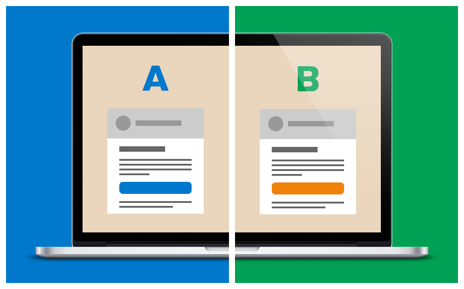
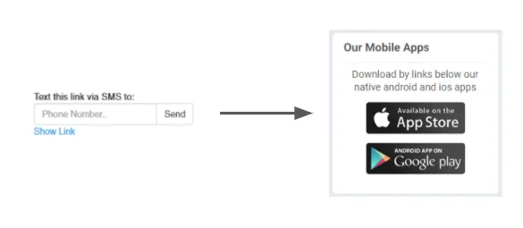
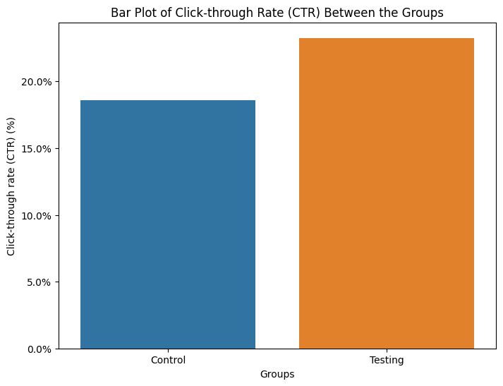

# **The Power of a Button: Unlocking Customer Engagement through Hypothesis Testing**

## **Introduction**

In 2022, over 268 million people shopped online in the United States. With so much competition, how do you ensure your e-commerce website stands out and converts these shoppers into loyal customers? Optimizing website design isn't just about appearances. This project explores the power of simple UI changes in driving customer engagement, demonstrating how seemingly minor changes can significantly boost engagement and have tangible implications for business success.

Having delved into concepts like A/B testing and hypothesis testing, I was eager to apply this theoretical knowledge to a real-world scenario. This project provided the perfect opportunity to bridge the gap between theory and practice. By analyzing user behaviour on a grocery store website's Loyalty program signup, I could not only investigate the impact of UI changes but also gain valuable insights into how theoretical frameworks interact with real-life data.

## **Project Goal**

The primary objective of this project was to determine whether replacing a hyperlink with a button for the Loyalty program signup on a grocery store website would significantly impact the number of customers signing up. Analysis of A/B testing dataset and hypothesis testing were employed to investigate if the observed change in signups was due to the UI change or simply random chance.

## **Results**

Leveraging A/B testing dataset and hypothesis testing, this project investigated the impact of UI changes on customer engagement for a grocery store's Loyalty program signup. The core hypothesis was that replacing the existing hyperlink with a button would lead to a significant increase in signups.

The results provided strong evidence in favour of the hypothesis. Users exposed to the button displayed a statistically significant **4.66% increase in Click-Through Rate (CTR)** for signing up for the Loyalty program compared to those encountering the hyperlink.

## **Executive Summary**

### **Data Source**
This project utilized a publicly available dataset from Kaggle titled "Grocery Website Data for AB Testing" ([link to the dataset](https://www.kaggle.com/datasets/tklimonova/grocery-website-data-for-ab-test/data)). The dataset provides valuable data for analyzing user behaviour in an e-commerce setting. The data encompasses one week of website interactions, segmented into a testing group (Server ID: 1) and a control group (Server IDs: 2 & 3).

The dataset includes the following columns:

| Column         | Description                                                  | Type          | Classification |
|----------------|--------------------------------------------------------------|---------------|----------------|
| `RecordID`     | Identifier of the row of data                                | Integer       | Categorical    |
| `IP Address`   | Address of the user, who is visiting website                 | String        | Categorical    |
| `LoggedInFlag` | 1 - when the user has an account and logged in, 0 otherwise      | Integer (0/1) | Categorical    |
| `ServerID`     | One of the servers user was routed through                   | Integer (1/2/3) | Categorical    |
| `VisitPageFlag`| 1 - when the user clicked on the loyalty program page, 0 otherwise | Integer (0/1) | Categorical    |

### **Data Preparation**

Following data import and preliminary exploration, the dataset underwent cleaning to ensure robust analysis. This included:

* **De-duplication:** User actions were aggregated by a unique IP address to account for potential duplicate entries within the same household or arising from repeated logins/logouts.
* **New User Filtering:** The data was filtered to exclusively focus on user interactions for individuals without existing accounts (logged in = 0).
* **Feature Engineering:** An additional column was created to categorize entries as belonging to the testing group (Server ID: 1) or the control group (Server IDs: 2 & 3).

### **Data Segmentation**

To facilitate A/B testing analysis, the dataset was split into distinct control and testing groups based on the assigned Server ID. The resulting groups had the following sample sizes:

* **Testing Group:** 16543 entries
* **Control Group:** 32970 entries

**Key Point:** These large sample sizes increase the accuracy and reliability of subsequent statistical analyses.

### **Analyzing Click-Through Rates (CTR)**

A key metric in this A/B test was the Click-Through Rate (CTR), which measures the percentage of users who clicked on the Loyalty program signup link/button relative to the total number of users who saw it. We investigated potential differences in CTR between the control and testing groups.

**CTR Comparison: Button vs. Link**

The calculated CTR values for each group are presented in the following bar chart:

*As the bar plot illustrates, the initial analysis reveals a higher CTR for the **testing group (23.26%)** compared to the **control group (18.60%)**.*

**Important Note:**

While this initial observation suggests a potential difference, it's crucial to go beyond a simple comparison and assess the statistical significance of this difference. This will be addressed in the next section on Hypothesis Testing. 

### **Verifying Assumptions Before Statistical Testing**

Before applying statistical tests, it's crucial to verify that our data meets the underlying assumptions of the chosen test. This ensures the validity and reliability of our results.

* **Normality:** We assessed data normality using the Shapiro-Wilk test. Both the control and testing groups exhibited non-normal distributions (p-value < 0.05). Since normality is an assumption for many parametric tests, this suggests the use of a non-parametric alternative.

* **Homogeneity of Variance:** While relevant for parametric tests, homogeneity of variance (equal variances between groups) wasn't evaluated due to the confirmed non-normality.

**Choosing the Right Test:**

Given the non-normal data distribution, a non-parametric test, the Mann-Whitney U test, is a more suitable choice for analyzing the CTR difference between the control and testing groups.

**Key Point:** Verifying assumptions ensures we select the appropriate statistical test, leading to more reliable conclusions for our hypothesis testing on the A/B testing dataset's results.

### **Hypothesis Testing: The Mann-Whitney U Test for Binary Data**

Due to the non-normal data distribution confirmed earlier, we employed the Mann-Whitney U test. This non-parametric test is suitable for comparing two independent groups and is particularly useful for binary data (like clicks vs. non-clicks in our case).

**Hypotheses:**

* **Null Hypothesis (H0):** The distribution of clicks (0s and 1s) is the same for both the control and testing groups, indicating no impact of the UI change on signup rates (p-value > 0.05).
* **Alternative Hypothesis (H1):** The distribution of clicks differs between the two groups, suggesting the UI change likely influenced signup rates (p-value ≤ 0.05).

**Test Results:**

The Mann-Whitney U test indicated a very small p-value (<0.05), allowing us to confidently **reject the null hypothesis**.

**Interpretation:**

By rejecting the null, we conclude a statistically significant difference in the distribution of clicks between the control and testing groups. Combining this with our earlier observed CTR differences (Button: 23.26%, Hyperlink: 18.60%), we can confidently assert that the button UI change led to a **4.66% increase** in the signup rate for the Loyalty program.

## **Next Steps: Expanding My A/B Testing Skills**

This project provided a valuable foundation in A/B testing methodologies. Moving forward, I'm eager to:

* **Apply A/B Testing in Real-World Scenarios:** Working with larger, real-world datasets within a company setting would be a fantastic opportunity to utilize these skills to make a tangible impact on product development or website optimization.

* **Mastering the Data Collection Process:** Beyond the analysis, actively participating in data collection and test setup would provide a more holistic understanding of the A/B testing process. 

* **Exploring Broader Applications of A/B Testing:** A/B testing plays a crucial role in marketing optimization. Delving deeper into this aspect would be particularly interesting, especially considering the significant impact even small changes can have on conversion rates.

## **Get Hands-On: A/B Testing Implementation**

**For any readers interested in a more detailed explanation of the analysis, code implementation, and thought processes behind this Hypothesis Testing project, my Jupyter Notebook** [*(Click here)*](./ab_testing_analysis.ipynb) **provides a comprehensive walk-through. This resource is perfect for those who want to learn how to implement hypothesis testing on a A/B Testing dataset on their own and gain a deeper understanding of the concepts involved.**

## **Conclusion**
This project successfully demonstrated the power of UI optimization and data-driven decision-making within the context of e-commerce and customer engagement. Utilizing A/B testing and the Mann-Whitney U test, we uncovered a statistically significant difference in Click-Through Rates (CTR) between a button and a hyperlink for promoting signups to a grocery store's Loyalty program.

The button design resulted in a 4.66% increase in CTR, underscoring the considerable impact that even seemingly minor UI changes can have on customer behaviour. For businesses, this highlights the potential for increased conversions and stronger customer engagement through well-planned website optimization. 

Beyond the immediate findings, this project was a valuable learning experience. It allowed me to apply theoretical concepts from A/B testing and hypothesis testing to a real-world dataset. I am eager to build upon this foundation, continuing to explore how data-driven insights can drive business success through website optimization, marketing strategies, and other applications.